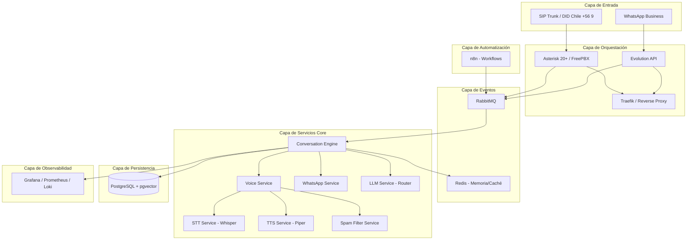
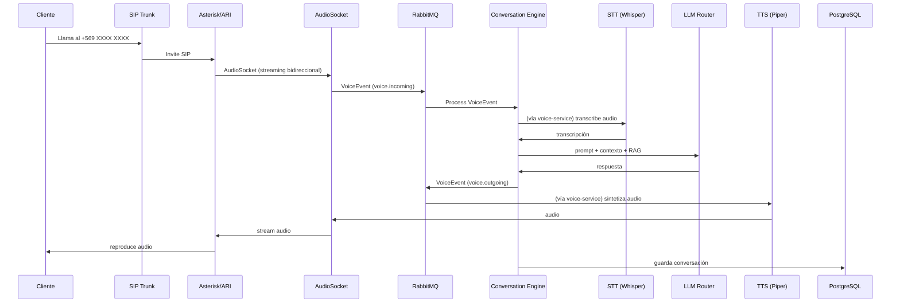
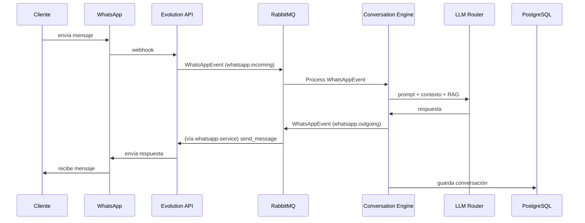
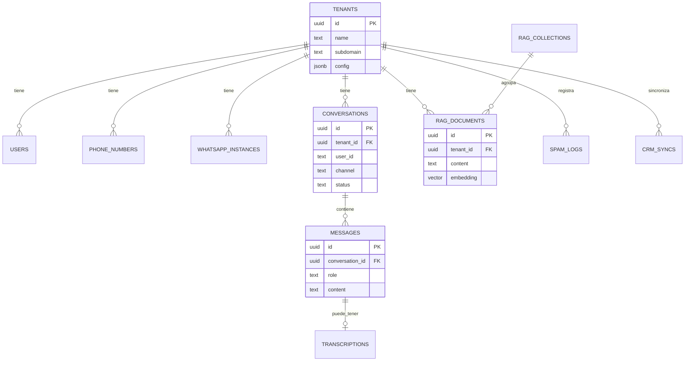
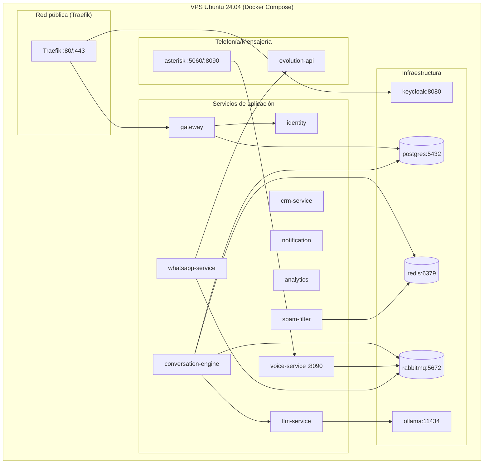

# Arquitectura — Netxia Conversational Platform

## 1. Diagrama de componentes

## 2. Flujo de llamada telefónica

## 3. Flujo de WhatsApp

## 4. Diagrama Entidad-Relación (resumen)

Ver el esquema SQL completo y ejecutable en `scripts/init_db.sql`.

## 5. Diagrama de despliegue (VPS único)

